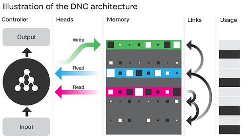
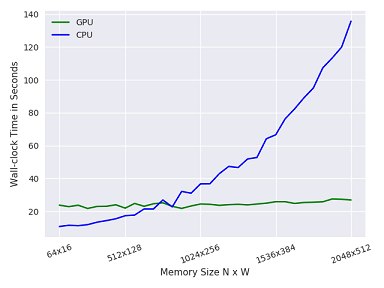
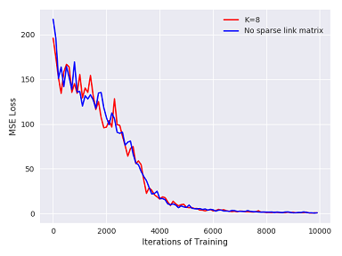
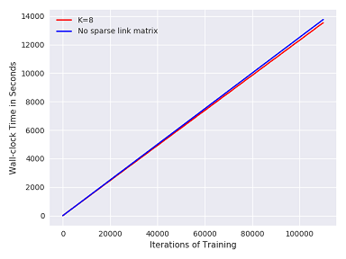
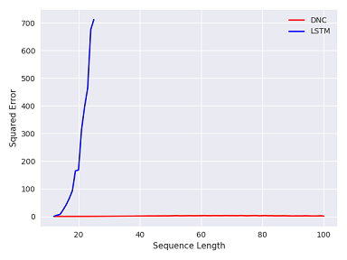

# Optimized Differentiable Neural Computer In Chainer
This is an optimized implementation of the [Differentiable Neural Computer (DNC)](https://deepmind.com/blog/differentiable-neural-computers/), in [Chainer](https://chainer.org). It was built up using an implementation of the DNC in Chainer by [yos1up](https://github.com/yos1up/DNC). This implementation was created as part of my MSc dissertation in Artificial Intelligence under the supervision of [Subramanian Ramamoorthy](http://homepages.inf.ed.ac.uk/sramamoo/) at the University of Edinburgh. My research aims to use the DNC in the [World Models](https://arxiv.org/abs/1803.10122) framework (check out [my implementation](https://github.com/AdeelMufti/WorldModels)). 

The DNC is a form of a memory augmented Neural Network that has shown promise on solving complex tasks that are difficult for traditional Neural Networks. When an RNN or LSTM is used as the Neural Network in the DNC architecture, it has the capacity to solve and generalize well on tasks with long temporal dependencies across a sequences.  

At each timestep in a sequence, the DNC receives an external input, and memory data read from its internal read head mechanism from the previous timestep (with timestep 0 being a vector of 0's), to manipulate its internal state and produce the next output. The memory in the DNC is said to be external because the DNC can be trained on a smaller memory size, and then attached to a larger memory matrix.

>   

## About This Implementation
Unfortunately, no optimized implementation of the DNC was publicly available in Chainer, and yos1up's implementation was not feasible to use in my experiments due to the wall-clock time it took to train on large datasets. So this implementation was created. 

This implementation features:

* GPU acceleration using [CuPy](https://cupy.chainer.org/)
* Sparse link matrix, as described in the [DNC paper](https://www.nature.com/articles/nature20101) (2nd page of *Methods* section), which reduces computation cost from *O(n^2)* to *O(n log-n)* for the Link matrix  
* Avoidance of *for* loops in the core computational mechanism of the DNC  

## Optimization Results

With this implementation, I observed **~50x** speedup over yos1up's Chainer DNC implementation on the addition toy task, using *K=8* for the sparse link matrix, with both implementations run on a CPU. With all the same hyperparameters (memory size, read heads, hidden units, etc), yos1up's implementation takes *217.97 seconds* for 10 iterations of training on a constant sequence length of 12, while this optimized DNC takes *4.34 seconds*!

In an attempt to speed it up further, I created an implementation (not available here) that could process sequences in batches. But this approach failed to converge even on simple tasks for any batch size greater than 1. I believe this is because for every row in a sequence being processed, the internal state and external memory of the DNC is manipulated, so a *for* loop would be necessary internally to process each sequence row item in the batch individually. Thus, I left it to the external code to contain this loop, and the DNC to always take a batch size of 1.

**Another important note:** with small memory sizes such as 256x64, running on CPU with NumPy is *faster* than running it on GPU with CuPy! GPUs are best at massive parallel computation, with larger batch sizes, but we are limited to a batch size of 1. However, the GPU accelerated DNC outperforms (in wall-clock time for training) versus the CPU when the memory size is larger.

Below follow results to test the optimizations. All results were recorded using an Amazon [g3.4xlarge](https://aws.amazon.com/ec2/instance-types/g3/) instance with and without GPU acceleration.

#### GPU vs CPU
> **Wall-clock training time for 100 iterations on the addition task, with increasing memory sizes.**  
> *As you can see, a GPU completely outperforms a CPU as the memory size grows.*  
>   

#### Sparse link matrix performance
> **MSE loss on addition task with sparse link matrix disabled versus sparse link matrix with K=8.**  
> *Using a sparse link matrix does not degrade performance*.  
>   

> **Wall-clock training time of the addition task with sparse link matrix disabled versus sparse link matrix with K=8, memory size 256x64**  
> *Training is slightly faster with the sparse link matrix, which can compound over time over large datasets for complex tasks, especially with larger memory.*   
>   


## Toy Task Results

To test this implementation, some (simple) toy tasks were created that are available with this code. While the authors of the DNC tested it on much more complex problems, I found these tasks to be useful for quickly testing the implementation, and getting a feel for the DNC. 

The toy tasks are: 

1. **Repeat**: Simply echo a row-wise sequence of randomly generated 0's and 1's
2. **Addition**: Sum a randomly generated row-wise sequence, with a 1 in each row representing a number based on the column (position) it is contained in. Example below.
3. **Priority sort**: Harder task. Essentially involves repetition as well. A row-wise sequence of randomly generated 0's and 1's are to be sorted according to a priority assigned to each row, with the priority sampled uniformly from [-1,1]. This task was used in the Neural Turing Machines (DNC's predecessor) [paper](https://arxiv.org/abs/1410.5401) (pg. 19).

#### Example results
> **An example test sequence on the addition task run on a trained DNC.  
> The very last row of the input, with the 1 in the last column, is the delimiter marking the end of the sequence:**
```
Input Data:
[[0. 0. 1. 0. 0. 0.]
 [1. 0. 0. 0. 0. 0.]
 [0. 0. 1. 0. 0. 0.]
 [1. 0. 0. 0. 0. 0.]
 [0. 0. 0. 0. 1. 0.]
 [1. 0. 0. 0. 0. 0.]
 [0. 0. 0. 0. 1. 0.]
 [0. 0. 0. 0. 0. 1.]]
(Represents: 2 + 0 + 2 + 0 + 4 + 0 + 4)
Target Data:
[[ 0.]
 [ 0.]
 [ 0.]
 [ 0.]
 [ 0.]
 [ 0.]
 [ 0.]
 [12.]]
DNC Output:
[[-0.14442]
 [-0.30143]
 [-0.24193]
 [-0.16146]
 [0.08639]
 [0.01805]
 [0.03887]
 [12.01316]]
``` 

**Note:** While you may not see the DNC return exact results (perfect 0's and 1's returned in the DNC's output), if you look closely, you'll note that the results follow the right pattern. For example, for the repeat and priority sort tasks, given enough training (especially for priority sort), you'll note that wherever there are supposed to be 1's, the DNC will return values closer to 1's, and wherever there are supposed to be 0's, the DNC will return values closer to 0's.

#### Generalization 

I observed that simple LSTMs learn these toy tasks faster--they were able to solve the task in fewer iterations of training. However, I observed that they fail to generalize when they see longer sequences than they were trained on, in comparison to the DNC. 

I tested this out by training both a simple LSTM model and DNC (same number of hidden units in both) for 50,000 iterations on the same task. A maximum input sequence length of 12 was used during training. Then, I input each model with sequence lengths greater than 12. The results of the simple LSTMs started diverging rapidly with sequence lenghts greater than 12, while the DNC was able to get excellent accuracy up to sequence lengths of 100! This goes to show that the DNC learns algorithmic tasks that can make use of its memory, and presents a solid step towards generalization.

> **Error over increasing sequence lengths on the addition task with simple LSTMs versus DNCs trained for 50k iterations.**  
> *Both were trained using a random sequence length between 2 and 12, and had never seen longer sequence lengths during training. As you can see, simple LSTMs quickly diverge on sequences greater than 12, while the DNC is very robust to generalizing on longer sequences. The error for LSTMs becomes so large, that matplotlib refuses to plot it beyond a certain threshold alongside DNC's error!*  
>   


## Usage  
Set up your environment:  

`conda install chainer numpy cupy`  

To try it on toy tasks, run from the command line using:  
`python dnc.py [arguments]`  
For example:  
`python dnc.py --task addition`

**Arguments:**

| Argument|Default|Description|
|---|---|---|
| --hps | 256,64,4,256,8 | N,W,R,LSTM hidden units,K. N=number of memory locations, W=width of each memory location, R=number of read heads, K=number of entries to maintain in the sparse link matrix. Check the [DNC paper](https://www.nature.com/articles/nature20101) for more details. |
| --gpu | -1 | Device ordinal for GPU to be used (usually 0 if you have 1 GPU). -1 means use CPU. |
| --lstm_only | False | Use this argument to turn off DNC and use simple LSTMs for training/testing. Good for comparison of results on toy tasks. |
| --task | addition | Which task to test: **addition**, **repeat**, **priority_sort**. |
| --max_seq_len | 12 | Sequences generated per iteration of training are randomly picked to be up to this length. |
| --max_seq_wid | 6 | Number of elements in each sequence row per iteration of training. This remains fixed. |
| --test_seq_len | 0 | Test longer sequence length than trained on to check generalization. 0 = off. Will only work if a task has been trained and saved (automatically saved during training periodically). |
| --iterations | 100000 | This many randomly generated sequences will be used for training for the selected task. |

Throughout training, a model will be saved every 50,00 iterations in a sub-folder named *result*.

#### Using The DNC In Place Of LSTMs In Your Own Projects
The DNC in this code should seamlessly plug into your Chainer projects. Simply import it, and treat it like a [Link](https://docs.chainer.org/en/stable/reference/links.html). Use it in place of an LSTM, and see what happens!  

**Note:** You'll need to use a batch size of 1 when feeding training data.
```python
from lib import DNC

class MyModel(chainer.Chain):
    def __init__(self, input_dim=35, hidden_dim=256, output_dim=32, K=8, gpu=-1):
        super(MyModel, self).__init__(
                             # X, Y, N, W, R, lstm_hidden_dim, K, gpu
            lstm_layer = DNC(input_dim, output_dim, 256, 64, 4, hidden_dim, K, gpu)
        )
    #...
    
model = MyModel(...)
model.to_gpu(...)
```

>   
> An artists's impression of the Differentiable Neural Computer.

## License
This code is available under the [MIT](https://opensource.org/licenses/MIT) license.